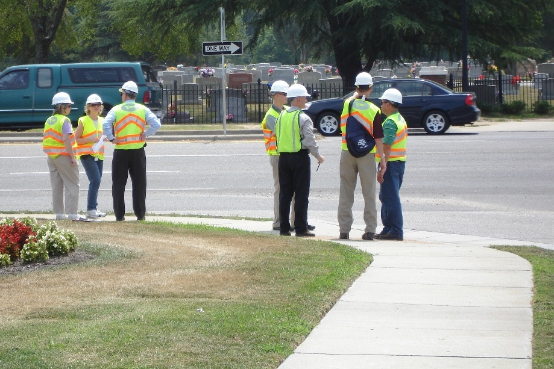

# Improving Transportation Safety through Data-Driven Technologies

Many of us can think of an intersection in our towns and cities where traffic feels unsafe. The impact of unsafe roads is felt by every road user, from drivers, to bikers and pedestrians. In 2016 alone, there were more than 40,000 traffic fatalities in the United States. Any one of those fatalities could happen at an intersection close to your home, areas we typically assume to be safe.

There are many people already engaged in improving road infrastructure to create safer intersections. For them, quicker and more complete traffic studies can greatly expedite these changes, and increase the safety of the road for everyone.

 

This is where the CrossRoad Platform can make change. This cloud-based analysis tool provides safety metrics from video of intersections to those who are concerned with traffic safety. Continue reading below to learn more about the software, or [contact us](mailto:{{ site.email }}) to begin understanding an intersection near you. 

We have a number of **pilot programs** starting in the general Boston area. If you are interested in learning more,
- [reach out](mailto:{{ site.email }})
- [read about our other studies](/users/) and where we are heading.
